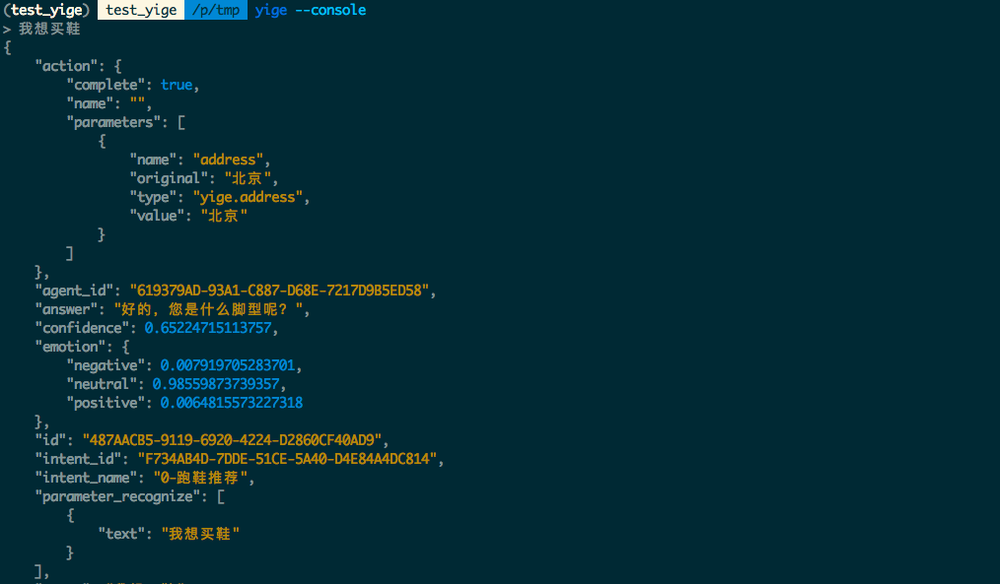
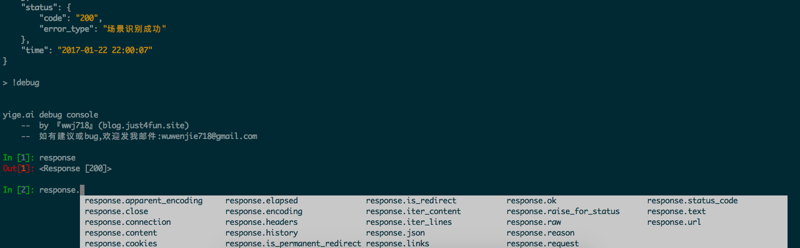

# yige-python

为yige.ai写的python sdk.  [英文版](https://github.com/wwj718/yige-python/blob/master/README.rst)

*  开源协议: MIT license
*  Documentation: https://yige-python.readthedocs.io.

# 简介
yige.ai的非官方python sdk，方便大家在python下使用yige.ai

下边是采用[asciinema](https://github.com/asciinema/asciinema)制作的[演示视频](https://asciinema.org/a/7alk907q48i8evcgqdc09s9xu)

[](https://asciinema.org/a/7alk907q48i8evcgqdc09s9xu)

# 特性
*  命令行调试界面
*  query
*  实体创建

# 安装
`pip install yige`

或者源码安装：

`pip install https://github.com/wwj718/yige-python.git`


# 使用

### 在命令行里使用（debug console）
```
export YIGE_ACCESS_TOKEN=xxx #客户端访问令牌
yige --console #初次运行会安装ipython
```




深入调试



### 作为python库使用

1. query

```python
import yige 
CLIENT_ACCESS_TOKEN = '<YOUR_CLIENT_ACCESS_TOKEN>' #客户端访问令牌
ai = yige.Yige(CLIENT_ACCESS_TOKEN)
request = ai.text_request()
request.query = "我想买鞋"
query_response = request.getresponse() #注意置信度 confidence
print(query_response.json())
```

为了方便大家管理action，该项目提供了一些脚手架来帮助大家，可能会影响到整个flow，如果有更好的建议欢迎提出

```
from yige import Yige,ActionHandle,run_action

class MyActionHandle(ActionHandle):

    def __init__(self,query_response):
        ActionHandle.__init__(self,query_response)

    def action_get_weather(self,**kwargs):
        '''
        以action_开头，get_weather 为 yige的动作名称
        kwargs is dict : action parameters and _answer
        '''
        for name, value in kwargs.items():
            print(name,value)
        # 接入本地api或是网络服务
        weather = "晴天☀️"
        return weather
    # tip 如果什么都没命中 yige会接入到闲聊


#print(query_response.json())
a_h = MyActionHandle(query_response) #query_response 与上边的例子相同
action_res = run_action(a_h) 
print(action_res)
```

具体demo参考`examples/action_handle.py`

2.  实体创建

```python
DEV_ACCESS_TOKEN = '<YOUR_DEV_ACCESS_TOKEN>' #开发者访问令牌
ai = yige.Yige(DEV_ACCESS_TOKEN)
payload= {}
payload["name"] = "脚型" # 词库名称
payload["type"] = 1 #是否定义同义词 1是  0否
payload["automated_expansion"] = 0
payload["entries"] = [] # 词库内容
entity1 =  {
             "value": "正常内旋", # 同义词中比较权威的名称
             "synonyms": [ #  同义词
                 "正常内旋",
                 "内旋正常",
                 "正常足弓",
                 "足弓正常"
             ]
         }
payload["entries"].append(entity1)
user_entities_request = ai.user_entities_request()
user_entities_request.user_entities = payload
user_entities_response = user_entities_request.getresponse()
print(user_entities_response.json())
```

3. 场景

waiting...

# 例子 🌰

1. 可以直接翻阅examples目录下的例子 🌰
2. 记得在网页里获得你的CLIENT_ACCESS_TOKEN


# 测试
`make test`

# Credits
This package was created with [Cookiecutter](https://github.com/audreyr/cookiecutter) and the [audreyr/cookiecutter-pypackage](https://github.com/audreyr/cookiecutter-pypackage) project template.
